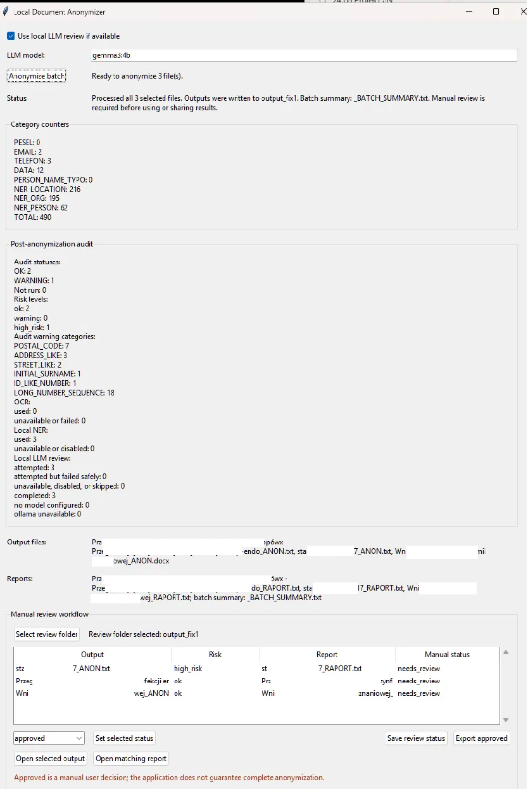

# Local Document Anonymizer

A local-first Python/Tkinter desktop tool for anonymizing text documents (TXT, DOCX, PDF, and images via OCR) entirely on the user's own machine — no cloud APIs, no external services, no databases.

**Status:** Working local MVP; Stage 24 PDF visual review cleanup completed.



*Batch run over 3 documents: category counters (PESEL, email, phone, dates, NER-detected names/orgs/locations), post-anonymization audit with risk levels (ok/warning/high_risk) and warning categories, and the manual review queue where each output must be approved before use. Filenames are redacted in this example.*

## Problem it solves

Manually redacting personal data (names, PESEL numbers, emails, phone numbers, addresses) from documents before sharing or archiving them is slow and error-prone. This tool automates the first pass — deterministic regex + optional local NER — and produces a separate anonymized copy plus a safe report, while treating manual human review as mandatory rather than optional. It is explicitly **not** a claim of complete, production-grade anonymization.

## Tech stack

- **Language:** Python
- **GUI:** Tkinter
- **Document I/O:** `python-docx` (DOCX), `pypdf` / `PyMuPDF` (PDF text extraction, true-redacted `_ANON_VISUAL.pdf` review artifacts, rebuilt review PDFs)
- **Optional OCR:** `pytesseract` + Pillow, backed by a locally installed Tesseract engine
- **Optional NER:** spaCy with a locally installed Polish model (`pl_core_news_sm`)
- **Optional LLM review:** local Ollama (no cloud calls, no bundled/auto-downloaded models)
- **Tests:** `unittest`, synthetic data only

## Key features

- Batch anonymization for TXT, DOCX, text-based PDF, and image (PNG/JPG/TIFF, via optional OCR) inputs
- Deterministic regex detection for `PESEL`, `EMAIL`, `TELEFON`, `DATA`, and a conservative name-typo pattern
- Optional private dictionary (user-maintained, case-insensitive, alias support) for organization-specific terms — never committed to the repo
- Optional local NER (person/org/location/misc) layered on top of the deterministic rules
- Optional local LLM (Ollama) review pass over already-anonymized text only — never sees raw source text
- Post-anonymization audit with a review-priority risk level (`ok` / `warning` / `high_risk`) — a prioritization hint, not a safety guarantee
- Safe reports and batch summaries containing counters and metadata only — never source text, snippets, or a replacement map
- Manual review workflow (`approved` / `needs_review` / `rejected`) with an approved-files export workspace
- Small local Knowledge Assistant CLI that indexes and answers questions over *approved* anonymized text only, with cited source chunks

Full stage-by-stage detail lives in [`docs/`](docs/) — see [`docs/TECHNICAL_OVERVIEW.md`](docs/TECHNICAL_OVERVIEW.md), [`docs/USER_GUIDE.md`](docs/USER_GUIDE.md), [`docs/SECURITY_ASSUMPTIONS.md`](docs/SECURITY_ASSUMPTIONS.md), and [`docs/ROADMAP.md`](docs/ROADMAP.md).

## Privacy model

Everything runs locally by default. There are no API calls, cloud services, or databases anywhere in the core flow. OCR, NER, and LLM review are all optional and only activate when their local dependencies are installed and explicitly enabled — nothing is downloaded automatically. The optional LLM review step only ever receives already-anonymized text, never raw source text or dictionary contents.

The repository itself must never contain real documents, real personal data, private dictionaries, or generated output/report files. Reports, review checklists, and summaries are designed to hold safe filenames, counts, labels, and anonymized-label context only, never source values.

## Installation

```bash
python -m venv .venv
.\.venv\Scripts\Activate.ps1
pip install -r requirements.txt
```

Optional extras (install separately, outside this repo):

```bash
# OCR — requires the Tesseract binary + language data installed on the system
# (pytesseract/Pillow/PyMuPDF are already in requirements.txt)

# NER — Polish spaCy model
python -m spacy download pl_core_news_sm

# LLM review — Ollama installed locally, with a model already pulled
ollama --version
ollama list
```

## Usage

Run the GUI:

```bash
python src/main.py
```

1. Add one or more supported files (`.txt`, `.docx`, `.pdf`, `.png`, `.jpg`, `.jpeg`, `.tif`, `.tiff`).
2. Select an output folder.
3. Optionally select a private dictionary, enable NER, choose the PDF output mode, or enable local LLM review with a locally installed Ollama model selected from the GUI.
4. Click **Anonymize batch** and check the generated `_ANON` files, `_REVIEW_CHECKLIST` checklists, `_RAPORT` reports, and batch summary.
5. Use the manual review section to mark each output `approved` / `needs_review` / `rejected`, then optionally export an `approved/` workspace.

Local Knowledge Assistant, over an approved workspace:

```bash
python -m src.knowledge_cli build-index approved/
python -m src.knowledge_cli ask approved/_KNOWLEDGE_INDEX.json "What does the procedure require?"
```

Run the tests:

```bash
python -m unittest discover -s tests
```

## Project structure

```text
src/
  anonymizer.py        Core engine and file workflow dispatchers
  audit.py             Post-anonymization audit
  file_readers.py      TXT, DOCX, and text-based PDF reading
  file_writers.py      _ANON output, checklist, and _RAPORT path helpers
  checklist.py         Safe manual review checklist generation
  gui.py / main.py     Tkinter GUI and entry point
  knowledge_assistant.py / knowledge_cli.py
                       Local index, retrieval, and CLI for approved TXT
  llm_review.py        Optional local Ollama review layer
  ner.py               Optional local spaCy NER helpers
  ocr.py               Optional local OCR detection and extraction helpers
  pdf_redaction.py     Visual redaction for text-based PDFs
  report.py            Report generation
  review.py            Manual review and approved-workspace metadata
  sensitive_terms.py   Private dictionary parsing and matching
tests/                 Synthetic unit tests (regex engine, file I/O, GUI dispatch,
                       audit, review workflow, NER/OCR/LLM mocked behavior)
examples/              Synthetic example inputs and dictionaries
docs/                  Technical overview, user guide, security assumptions, roadmap
```

## Known limitations

- Manual review is always required — this is not production-ready, complete anonymization.
- OCR, NER, and LLM review are all optional, local-dependency-based, and imperfect; each can miss or misclassify content.
- Regex detection and private-dictionary matching are deterministic and conservative, not fuzzy/ML-based.
- PDF input now writes `_ANON.txt`, `_ANON_VISUAL.pdf`, `_ANON_REVIEW.pdf`, `_REVIEW_CHECKLIST.txt`, and `_RAPORT.txt` by default for text-based PDFs. `_ANON_VISUAL.pdf` is the primary original-layout manual review artifact and uses true PyMuPDF redaction annotations mapped from detected text spans to word coordinates. `_ANON_REVIEW.pdf` remains an auxiliary rebuilt-text review PDF.
- PDF visual redaction is text-layer based. It can miss unusual encodings, rotated/fragmented text, forms, annotations, or text embedded in images; there is no scanned-PDF/OCR bounding-box redaction. Legacy `_ORIGINAL_REDACTED.pdf` remains experimental.
- Stage 24 precision filters intentionally leave weak table-like phone numbers, selected public/institution/health-domain NER false positives, ordinary-word false positives, and single-token person-like NER detections visible unless stronger context exists; reports/checklists show category-only skipped counts.
- DOCX support covers basic paragraphs and simple tables only (no headers, footers, comments, or embedded images).
- Batch processing is sequential.
- Audit risk levels are a review-prioritization hint, not a safety guarantee.

See [`docs/PROJECT_STATE.md`](docs/PROJECT_STATE.md) for the full current-state writeup and [`docs/ROADMAP.md`](docs/ROADMAP.md) for stage-by-stage history.

## Portfolio note

This project is a portfolio MVP: a small, offline document anonymization tool with clear privacy boundaries, deterministic core behavior, and synthetic tests. It's meant to demonstrate a reviewable local workflow, not to claim complete, unsupervised document anonymization.
